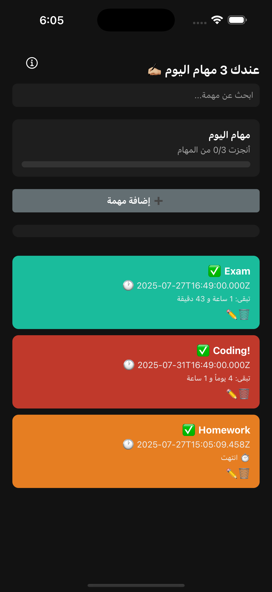
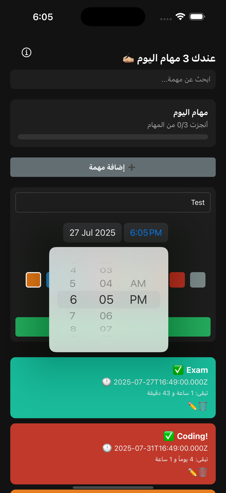
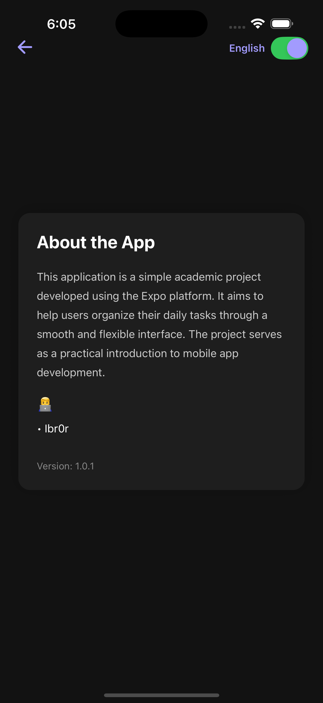

<p align="left">
  
</p>

---
A simple and clean task management mobile app built with **React Native** and **Expo**. This app helps users manage their daily tasks efficiently with a dark-themed interface and a lightweight UX.

> 🎓 This project was developed as a final submission for the *Software Project Management* course.

---

## 📱 Screenshots

<div align="center">
  
  
  
</div>

---

## 🚀 Features

- Task list with simple UI
- Add & delete tasks
- About screen with language toggle + animated transitions
- Dark mode by default
- Cross-platform (iOS, Android)

---

## ⚙️ Tech Stack

| Tech                      | Version     |
|---------------------------|-------------|
| React Native              | 0.79.2      |
| Expo                      | 53.0.6      |
| React Navigation (Native) | 7.1.7       |
| DateTime Picker           | 8.3.0       |
| Animated API              | built-in    |

---

## 🧠 How to Run Locally

```bash
git clone https://github.com/yourusername/todo-app.git
cd todo-app
npm install
npm start
```
Or run on device:
```
npm run android   # for Android
npm run ios       # for iOS
npm run web       # for Web
```
---
 By  
**Eng. Ibr**